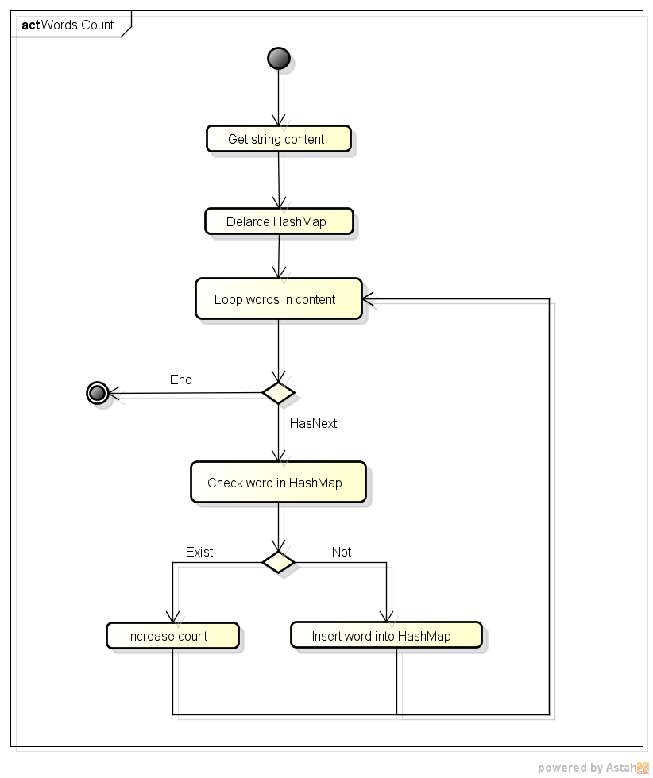

# word-count-spring-batch-partitioning
Use Spring Batch to implement count word in PDF files follow Master/Slave model
## Master/Slave model

## Word count algorithm

## Setup, build and run

## Initialize DB

Create schema for storing word-count and word-count-reposiory. Execute `create_schema.sql`

**Note:** If an error "language 'plpgsql' does not exist" happened when executing `create_schema.sql` 
  + Access to postgres directory by command `su -postgres`
  + Use this command `createlang -d dbname plpgsql`
  + Run `create_schema.sql` again

### SetUp

Open `application.properties` from *master* and config.

+ Config values for the datasource:
  + `batch.jdbc.driver`: Postgresql driver for datasource
  + `batch.jdbc.url`: URL of word_count data schema
  + `batch.jdbc.url_repo`: URL of job repository schema
  + `batch.jdbc.username` & `batch.jdbc.password`: User name & password to access datasource
+ Config values for database
  + `batch.schema.script`: Create schema
  + `batch.drop.script`: Drop schema
  + `batch.job_repo.databaseType`: Specify database type
+ Config ActiveMQ
  + `broker.url`: ActiveMQ URL

Open `application.properties` from *slave* and config.

+ Config pdf diretory path:
  + `processed.pdf.dir`: pdf directory path
+ Config delimeter
  + `delimiter`: Cut the word when matching delimeter

**Note:** Some properties in *slave* and *master* are same so don't need repeat
### Build

To build, execute from the top level directory:

`$ mvn clean install`

### Run

+ Start ActiveMQ

+ Start the slave:

`$ java -Djava.awt.headless=true -jar /word-count-partitioning-slave/target/remote-partitioning-slave-0.1.jar`

+ Start the master:

`$ java -jar /word-count-partitioning-master/target/remote-partitioning-master-0.1.jar`

